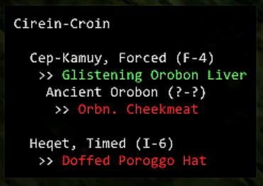

# FFXI Empyrean Pop Tracker

An FFXI Windower 4 addon that tracks items and key items for popping Empyrean NMs in Abyssea, such as Briareus, Apademak and Sobek.

## Load

`//lua load empypoptracker`

## Track an NM

`//ept track glavoid` tracks Glavoid pop items/key items.

You can also track an NM by typing the start of the name, because fuck having to remember how to spell Itzpapalotl:

`//ept track itz`

For a full list of trackable NMs, see the nms directory.

## Contributing

Notice something not quite right? [Raise an issue](https://github.com/xurion/ffxi-empy-pop-tracker/issues).

[Pull requests](https://github.com/xurion/ffxi-empy-pop-tracker/pulls) welcome!
